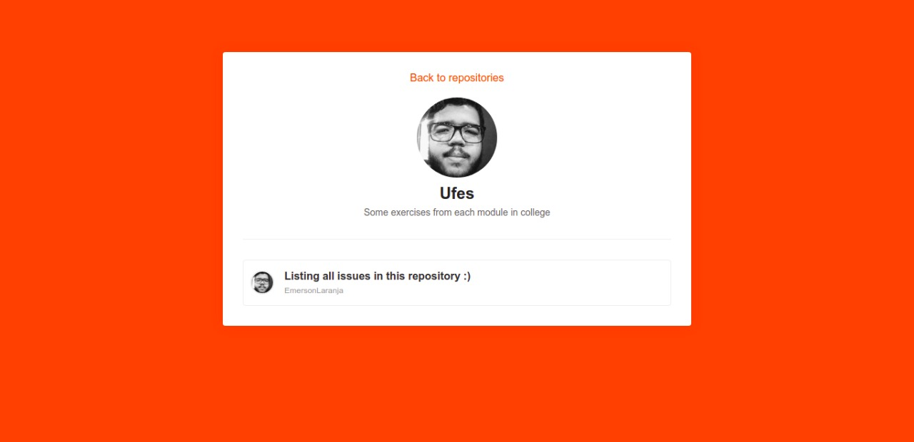

<h1 align="center">
 Searching a repo (Github)
</h1>

# 🖼️ Images

## 📝 License

This project is under license from MIT. See the [LICENSE](LICENSE) file for more details.

---

Feito com [🧡](https://www.linkedin.com/in/emerson-laranja-dos-santos-9b6064145/) by Laranja

